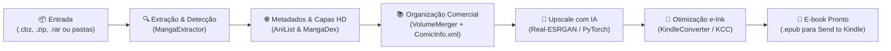

# 🌸 Kira — AI Manga Upscaling & Kindle Converter Pipeline

<div align="center">

[](https://www.python.org/)
[](https://pytorch.org/)
[](https://colab.research.google.com/)
[](https://www.amazon.com/sendtokindle)
[](tests/)

**Pipeline de inteligência artificial de ponta a ponta para restauração, ampliação (upscale) e conversão profissional de mangás para leitores digitais Kindle (e-Ink).**

[Guia de Início](docs/getting_started.md) • [Manual da CLI](docs/cli_reference.md) • [Guia do Colab](docs/google_colab_guide.md) • [Guia do Kindle](docs/kindle_guide.md) • [Arquitetura](docs/architecture.md) • [FAQ](docs/troubleshooting.md)

</div>

---

## ✨ Destaques do Projeto

- 🤖 **Upscaling Inteligente com IA**: Amplia traços finos de mangá e remove artefatos de compressão JPEG usando modelos neurais **Real-ESRGAN** (*RealESRGAN_x4plus_anime_6B*).
- 📚 **Divisão Comercial & Metadados Oficiais**:
  - Consulta automática à API do **MangaDex** e **AniList** para identificar o número oficial de volumes e capítulos da obra.
  - Baixa automaticamente as **capas oficiais em alta definição** de cada volume.
  - Injeta metadados comerciais **`ComicInfo.xml`** com título oficial, autores e orientação de leitura da direita para a esquerda.
- 🎯 **Detecção 100% Autônoma**: O Kira descobre o título da obra e o formato dos arquivos sozinho, sem exigir que você digite nomes ou configure parâmetros manuais.
- 📱 **Otimização Perfeita para e-Ink**: Adaptado para Kindle Paperwhite, Oasis, Scribe e Básico, com algoritmo de dithering, balanço de contraste/gama e suporte nativo ao serviço **Send to Kindle Web** (`.epub`).
- ⚡ **Orquestração na Nuvem (`kira colab-run`)**: Dispare o processamento em GPUs gratuitas do **Google Colab** diretamente pelo seu terminal local com apenas um comando e desligamento automático da VM.

---

## 🏗️ Como Funciona o Pipeline



---

## 🚀 Instalação Rápida

```bash
# 1. Clonar o repositório
git clone https://github.com/Wather17/kira.git
cd kira

# 2. Criar ambiente virtual
python3 -m venv venv
source venv/bin/activate

# 3. Instalar o Kira CLI
pip install -e .
```

---

## 💡 Exemplos de Uso

### 1. Processamento Local
```bash
# Processar um volume para Kindle Básico 11ª Geração (perfil padrão)
kira process -i "./mangas/Monster_Vol_01.cbz" -o "./kindle_pronto" -p K11 -f EPUB

# Processar pasta com múltiplos mangás em lote
kira process -i "./Manga_Inputs" -o "./Kindle_Outputs" -p K11 -f EPUB
```

### 2. Execução Remota na GPU do Google Colab
Dispare o pipeline completo na nuvem do Google Colab sem abrir navegador:
```bash
kira colab-run -i "Manga_Inputs" -o "Kindle_Outputs" --gpu T4
```

### 3. Unir Capítulos Avulsos em Volumes Oficiais
```bash
kira merge-volumes -i "./capitulos_soltos" -o "./volumes_comerciais"
```

---

## 📚 Documentação Completa

Toda a documentação detalhada do projeto está organizada na pasta [`docs/`](docs/):

| Guia | Descrição |
| :--- | :--- |
| 🚀 [**Início Rápido (Getting Started)**](docs/getting_started.md) | Passo a passo de instalação no Linux, WSL2, macOS e Windows. |
| 📖 [**Manual da Linha de Comando (CLI)**](docs/cli_reference.md) | Referência completa de todos os subcomandos, parâmetros e flags do `kira`. |
| ⚡ [**Guia do Google Colab & MCP**](docs/google_colab_guide.md) | Como utilizar GPUs remotas (T4/L4/A100), Notebook interativo e Colab MCP Server. |
| 📱 [**Guia de Otimização Kindle**](docs/kindle_guide.md) | Tabela de resoluções de tela, e-Ink dithering, envio via *Send to Kindle Web* e capas na tela de bloqueio. |
| 🏛️ [**Arquitetura & Engenharia**](docs/architecture.md) | Decisões técnicas de design, otimização de VRAM, resiliência de rede e conformidade com padrões da indústria. |
| 🛠️ [**Solução de Problemas (Troubleshooting)**](docs/troubleshooting.md) | Resolução de dúvidas frequentes, erros de memória CUDA e tratamento de falhas. |

---

## 📱 Dispositivos Kindle Suportados

| Perfil | Modelo do Leitor | Resolução Ideal |
| :--- | :--- | :--- |
| **`K11`** *(Padrão)* | Kindle Básico 11ª Geração (6.0") | **1072 × 1448** (300 PPI) |
| **`KPW5`** | Kindle Paperwhite 11ª Geração (6.8") | **1236 × 1680** (300 PPI) |
| **`KO`** | Kindle Oasis 2 e 3 (7.0") | **1264 × 1680** (300 PPI) |
| **`KS`** | Kindle Scribe (10.2") | **1860 × 2480** (300 PPI) |
| **`KPW34`** | Kindle Paperwhite 3 e 4 (6.0") | **1072 × 1448** (300 PPI) |
| **`KV`** | Kindle Voyage (6.0") | **1072 × 1448** (300 PPI) |
| **`K34` / `K57`** | Kindle 3/4/5/7 e Touch (6.0") | **600 × 800** (212 PPI) |
| **`OTHER`** | Outros e-readers / Tablets | Proporcional |

---

## 🧪 Testes Automatizados

O Kira conta com uma suíte abrangente de testes unitários para garantir a confiabilidade de todos os módulos:

```bash
pytest tests/
```
```
============================== 16 passed in 9.80s ==============================
```

---

## 📄 Licença

Distribuído sob a licença MIT. Consulte o arquivo de licença para obter mais informações.
