# 🏛️ Arquitetura e Decisões de Engenharia do Kira

Este documento detalha as decisões de engenharia, arquitetura modular e estratégias de desempenho adotadas no desenvolvimento do **Kira Manga Pipeline**.

---

## 1. Visão Geral do Sistema

O Kira foi projetado segundo o princípio de **Responsabilidade Única (SRP)** e **Baixo Acoplamento**, permitindo que cada etapa do processamento de mangás funcione de forma independente ou orquestrada em lote:

```mermaid
flowchart TD
    subgraph Entrada["1. Entrada Universal"]
        A1[".cbz / .zip"]
        A2[".rar / .cbr"]
        A3["Pastas de Imagens"]
        A4["Pacote de Capítulos"]
    end

    subgraph Extracao["2. Extração & Normalização"]
        B["MangaExtractor"]
    end

    subgraph Inteligencia["3. Inteligência Online"]
        C1["auto_detect_manga_title"]
        C2["OnlineMangaProvider"]
        C3["AniList API (Metadados)"]
        C4["MangaDex API (Volumes & Capas HD)"]
        C5["Jikan / MAL API (Fallback)"]
    end

    subgraph Organizacao["4. Organização Comercial"]
        D1["VolumeMerger"]
        D2["ComicInfo.xml Generator"]
        D3["Cover Optimizer (0000_cover.jpg)"]
    end

    subgraph Upscaling["5. Upscaling por IA"]
        E1["MangaUpscaler (Real-ESRGAN)"]
        E2["Tile Processing (VRAM Safe)"]
        E3["FP16 Half Precision"]
    end

    subgraph Conversao["6. Otimização Kindle"]
        F1["KindleConverter (KCC Engine)"]
        F2["E-Ink Dithering & Gamma"]
        F3["Right-to-Left (Manga Style)"]
    end

    subgraph Saida["7. Formatos de Saída"]
        G1[".epub (Send to Kindle)"]
        G2[".mobi / .azw3 / .cbz / .kfx"]
    end

    Entrada --> Extracao
    Extracao --> Inteligencia
    Inteligencia --> Organizacao
    Organizacao --> Upscaling
    Upscaling --> Conversao
    Conversao --> Saida
```

---

## 2. Decisões de Engenharia

### 2.1. Inteligência de Metadados & Resiliência de Rede ([`kira/providers.py`](file:///home/henrique/projetos/kira/kira/providers.py))
- **Mapeamento de Volumes**: Ao invés de depender de tabelas estáticas, o Kira consulta a API do MangaDex (`/manga/{id}/aggregate`) para descobrir dinamicamente quais capítulos compõem cada volume comercial.
- **Capas Oficiais em Alta Definição**: O MangaDex disponibiliza as capas oficiais de cada volume com IDs únicos. O Kira baixa e posiciona como `0000_cover.jpg` no topo da ordem alfabética.
- **Resiliência com Fallback em Cascata**:
  1. `AniList GraphQL API` (Metadados primários).
  2. `Jikan / MyAnimeList API` (Fallback secundário caso o AniList oscile).
  3. `Fallback Local` (Caso a máquina esteja offline, o pipeline prossegue sem quebrar).
- **Tratamento de Rate Limits e Conexão**: Implementado mecanismo com **3 tentativas (retries)**, **Exponential Backoff** e cabeçalho `User-Agent: KiraMangaPipeline/1.0` em conformidade com as diretrizes do Cloudflare e MangaDex, evitando bloqueios de IP ao executar em data centers (Google Colab).

### 2.2. Otimização de Memória e VRAM no Upscale ([`kira/upscaler.py`](file:///home/henrique/projetos/kira/kira/upscaler.py))
- **Processamento por Tiles (Mosaicos)**: Páginas de mangá podem atingir resoluções de 3000x4500 pixels. Rodar o modelo de IA na imagem inteira causaria `CUDA Out of Memory (OOM)`. O Kira utiliza divisão em blocos (`tile=400` pixels) com sobreposição suave.
- **Inferência em FP16 (Half-Precision)**: Em GPUs modernas (NVIDIA T4, L4, A100, RTX), o uso de ponto flutuante de 16 bits dobra a velocidade de inferência e reduz pela metade o consumo de VRAM sem perda perceptível de qualidade para ilustrações em preto e branco.
- **Downscale Inteligente para e-Ink**: Telas de Kindle possuem resoluções entre 1072x1448 (Paperwhite 3/4) e 1236x1680 (Paperwhite 5). Escalar uma imagem para 8K geraria arquivos gigantescos e lentos para o processador do Kindle. O Kira redimensiona proporcionalmente para o limite ideal da tela (`max_dimension=2400px`).

### 2.3. Conformidade Comercial para Kindle ([`kira/metadata.py`](file:///home/henrique/projetos/kira/kira/metadata.py) e [`kira/converter.py`](file:///home/henrique/projetos/kira/kira/converter.py))
- **`ComicInfo.xml`**: O padrão universal de metadados para quadrinhos é gerado com tags essenciais:
  - `<Manga>YesAndRightToLeft</Manga>`: Faz o Kindle abrir da direita para a esquerda.
  - `<Title>`, `<Series>`, `<Number>`, `<Writer>`, `
`.
- **Preservação de Metadados no KCC**: A integração com o Kindle Comic Converter utiliza `--keepcomicinfo` e `--metadatatitle 2`, garantindo que o título de exibição no Kindle seja idêntico ao e-book oficial da Amazon.
- **Correção de Flag Crítica**: No KCC, argumentos curtos como `-hq` são interpretados pelo `argparse` do Python como `-h` (help) + `-q`. O Kira padroniza o uso estrito de `--hq` para garantir a conversão em alta qualidade sem abortar o processo.

### 2.4. Orquestração Remota sem Head ([`kira/colab_runner.py`](file:///home/henrique/projetos/kira/kira/colab_runner.py))
- O módulo de execução remota utiliza o `google-colab-cli` para:
  1. Alocar uma instância remota com GPU acelerada (`colab new --gpu T4`).
  2. Montar o Google Drive de forma transparente (`colab drivemount`).
  3. Disparar a versão mais recente do código (`colab exec`).
  4. Transmitir o `stdout`/`stderr` em tempo real para o terminal local via subprocess streaming.
  5. Desligar a instância automaticamente (`colab stop`) no bloco `finally`, prevenindo consumo acidental de créditos da nuvem.

---

## 3. Estrutura de Módulos

| Módulo | Arquivo | Responsabilidade Principal |
| :--- | :--- | :--- |
| **CLI** | [`kira/cli.py`](file:///home/henrique/projetos/kira/kira/cli.py) | Interface de linha de comando com Rich e Click |
| **Pipeline** | [`kira/pipeline.py`](file:///home/henrique/projetos/kira/kira/pipeline.py) | Orquestrador principal de processamento em lote |
| **Extractor** | [`kira/extractor.py`](file:///home/henrique/projetos/kira/kira/extractor.py) | Extração de `.cbz`, `.zip`, `.rar`, `.cbr` |
| **Upscaler** | [`kira/upscaler.py`](file:///home/henrique/projetos/kira/kira/upscaler.py) | IA Real-ESRGAN com PyTorch, Tiles e FP16 |
| **Merger** | [`kira/merger.py`](file:///home/henrique/projetos/kira/kira/merger.py) | Agrupamento de capítulos avulsos em volumes oficiais |
| **Providers** | [`kira/providers.py`](file:///home/henrique/projetos/kira/kira/providers.py) | Integração com AniList, MangaDex e Jikan com retries |
| **Metadata** | [`kira/metadata.py`](file:///home/henrique/projetos/kira/kira/metadata.py) | Geração de `ComicInfo.xml` e padronização de capa |
| **Converter** | [`kira/converter.py`](file:///home/henrique/projetos/kira/kira/converter.py) | Otimização para e-Ink via Kindle Comic Converter |
| **Colab Runner**| [`kira/colab_runner.py`](file:///home/henrique/projetos/kira/kira/colab_runner.py) | Provisionamento e execução remota de GPU no Colab |
| **Utils** | [`kira/utils.py`](file:///home/henrique/projetos/kira/kira/utils.py) | Ordenação natural, sanitização e suporte Rclone |
